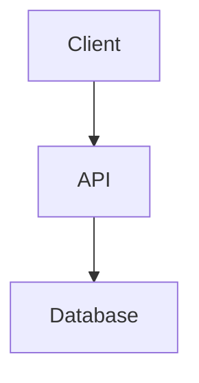

# Contributing to InMoney Knowledge Base

Thank you for contributing to the InMoney documentation!

## Documentation Standards

### File Naming
- Use lowercase with hyphens: `my-document.md`
- Keep names descriptive but concise
- Use `.md` extension for all documentation

### Markdown Formatting
- Use ATX-style headers (`#`, `##`, `###`)
- Include a single H1 (`#`) at the top of each file
- Use fenced code blocks with language identifiers
- Keep line length reasonable (80-120 characters)

### Document Structure

Each document should follow this template:

```markdown
# Document Title

Brief description of what this document covers.

## Overview

High-level explanation of the topic.

## Details

Detailed content with sections as needed.

## Examples

Practical examples where applicable.

## Related

- [Link to related doc](./path/to/doc.md)
```

## Adding New Documentation

### 1. Choose the Right Location

| Content Type | Location |
|-------------|----------|
| System-wide architecture | `architecture/` |
| API endpoints and specs | `api/` |
| Frontend (Angular) docs | `frontend/` |
| Backend (Workers) docs | `backend/` |
| Business domain knowledge | `domain/` |
| How-to guides | `guides/` |
| TypeScript types | `types/` |
| Product roadmaps | `roadmaps/` |
| Task tracking | `todo/` |
| Bug tracking | `issues/` |

### 2. Create Your Document

1. Create the file in the appropriate directory
2. Follow the document structure template above
3. Add links to related documents

### 3. Update Navigation

After adding a new document:
1. Update the parent folder's `README.md` with a link
2. Update the root `README.md` if it's a major addition

## Diagrams

### Mermaid Diagrams
Use Mermaid for diagrams when possible (GitHub renders them natively):

```markdown

```

### Image Files
- Store in `architecture/diagrams/` or relevant subfolder
- Use SVG format when possible
- Include source files (e.g., draw.io, Figma) if applicable

## Roadmaps

### Format
Roadmaps should follow this structure:

```markdown
# Roadmap: [Quarter/Period]

## Goals
- Goal 1
- Goal 2

## Features

### Feature Name
- **Status**: Planning | In Progress | Completed | Deferred
- **Priority**: High | Medium | Low
- **Description**: Brief description
- **Tasks**:
  - [ ] Task 1
  - [ ] Task 2
```

## TODO Items

### Format
```markdown
## [Category]

### Task Title
- **Status**: Pending | In Progress | Blocked | Done
- **Priority**: P0 | P1 | P2 | P3
- **Assigned**: @username (optional)
- **Description**: What needs to be done
- **Notes**: Additional context
```

## Issues

### Format
```markdown
## [Issue Title]

- **ID**: ISSUE-XXX
- **Status**: Open | In Progress | Resolved | Closed
- **Severity**: Critical | High | Medium | Low
- **Reported**: YYYY-MM-DD
- **Description**: Detailed description
- **Steps to Reproduce** (if bug):
  1. Step 1
  2. Step 2
- **Resolution**: How it was fixed (when resolved)
```

## Commit Messages

Use conventional commits:
- `docs: add API authentication guide`
- `docs(frontend): update NgRx patterns`
- `fix(docs): correct broken links`

## Review Process

1. Make changes in a feature branch
2. Create a pull request
3. Request review from relevant team members
4. Merge after approval

## Questions?

Open an issue or reach out to the maintainers.
