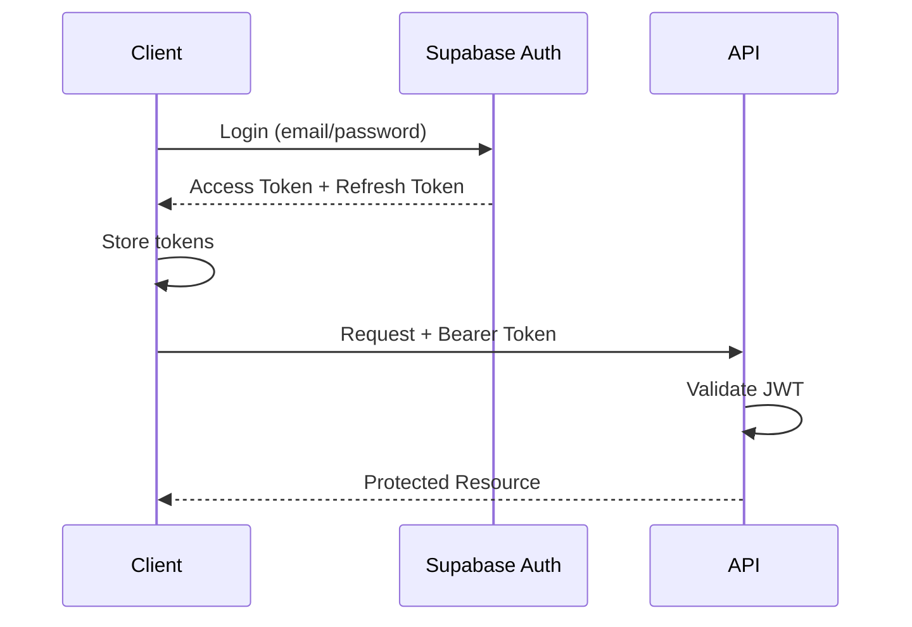

# Authentication

Authentication and authorization flows for InMoney.

## Overview

InMoney uses Supabase Auth for authentication:
- Email/password authentication
- OAuth providers (if configured)
- JWT-based session management

## Authentication Flow



## Token Management

### Access Token
- Short-lived JWT (~1 hour)
- Used for API requests
- Contains user claims

### Refresh Token
- Long-lived token
- Used to obtain new access tokens
- Stored securely (httpOnly cookie or secure storage)

## Frontend Implementation

### Login
```typescript
const { data, error } = await supabase.auth.signInWithPassword({
  email: 'user@example.com',
  password: 'password'
});
```

### Session Recovery
```typescript
const { data: { session } } = await supabase.auth.getSession();
```

### Token Refresh
```typescript
const { data, error } = await supabase.auth.refreshSession();
```

### Logout
```typescript
await supabase.auth.signOut();
```

## API Authorization

### Token Validation
The API validates tokens by:
1. Verifying JWT signature with Supabase JWT secret
2. Checking token expiration
3. Extracting user claims

### Protected Endpoints
```typescript
// Example middleware
const authMiddleware = async (req, env) => {
  const token = req.headers.get('Authorization')?.replace('Bearer ', '');
  const user = await verifyToken(token, env.SUPABASE_JWT_SECRET);
  if (!user) throw new UnauthorizedError();
  return user;
};
```

## User Roles & Permissions

| Role | Description | Permissions |
|------|-------------|-------------|
| `free` | Free tier user | Basic access |
| `pro` | Paid subscriber | Full access |
| `admin` | Administrator | All permissions |

## Security Considerations

- Tokens transmitted over HTTPS only
- Access tokens have short expiry
- Refresh tokens rotated on use
- CORS configured for allowed origins
- Rate limiting on auth endpoints
