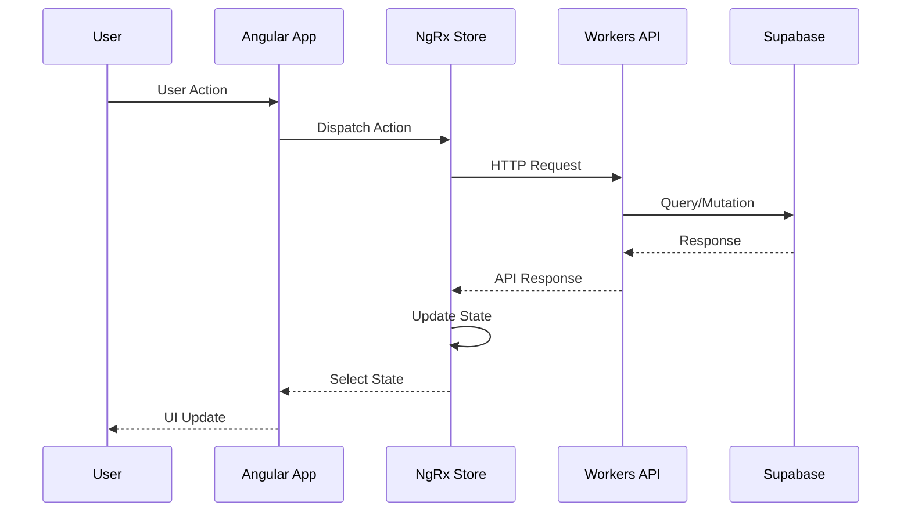
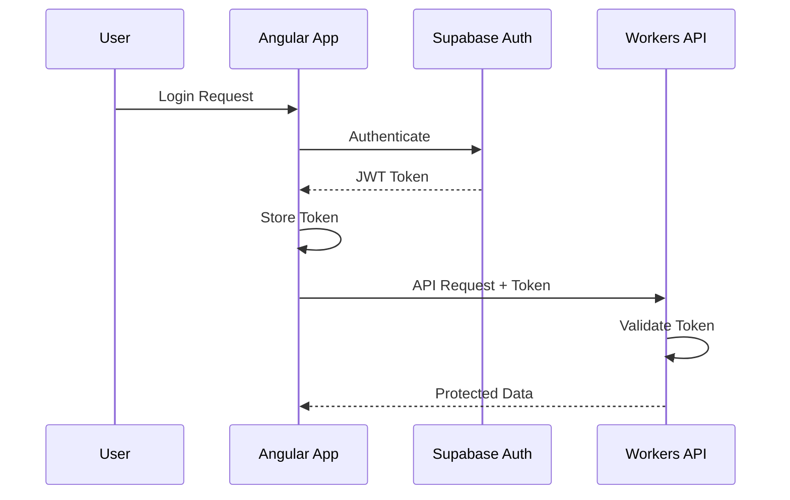
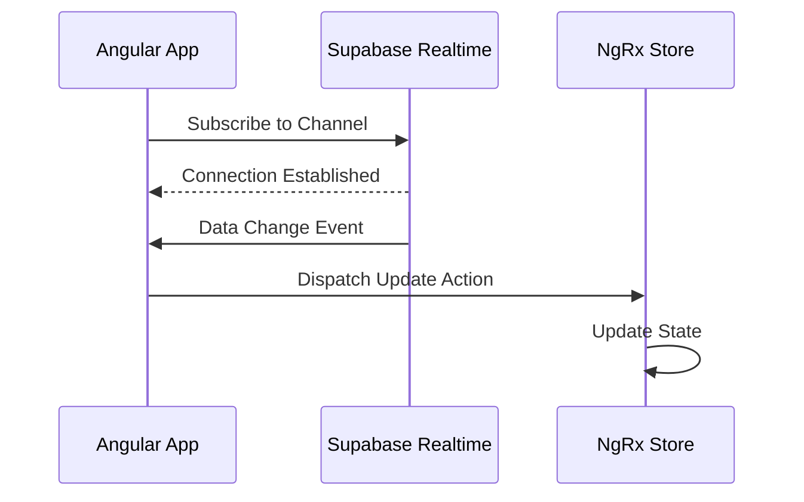

# Data Flow

How data flows through the InMoney system.

## Request Flow



## Authentication Flow



## Real-time Updates



## State Management Flow

### NgRx Data Flow

```
User Action
    ↓
Component dispatches Action
    ↓
Effects intercept (async operations)
    ↓
Reducer updates State
    ↓
Selectors compute derived State
    ↓
Component receives updated data
```

### Entity State

All entity collections follow this pattern:
- `ids`: Array of entity IDs
- `entities`: Dictionary of entities by ID
- `loading`: Boolean loading state
- `error`: Error state

## API Data Flow

### Ticker Data

1. User searches for ticker
2. Frontend dispatches `loadTicker` action
3. Effect calls API endpoint
4. API fetches from market data provider
5. Response cached in KV (if applicable)
6. Data returned to frontend
7. Entity adapter updates store

### Options Data

1. User views options chain
2. Frontend dispatches `loadOptionsSnapshot` action
3. Effect calls API with ticker symbol
4. API aggregates options data
5. Snapshot stored in store
6. Components select and display data

## Caching Strategy

| Data Type | Cache Location | TTL |
|-----------|---------------|-----|
| Ticker metadata | KV | 24h |
| Options snapshots | None | Real-time |
| User preferences | Local Storage | Persistent |
| Session data | Memory | Session |
