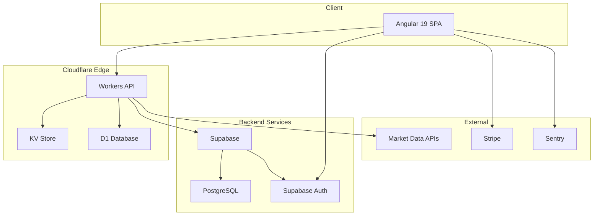

# System Architecture Overview

High-level architecture of the InMoney platform.

## Architecture Diagram

## Components

### Frontend (inmoney)

- **Framework**: Angular 19 with standalone components
- **State**: NgRx with entity adapters
- **Styling**: TailwindCSS 4 + DaisyUI
- **Change Detection**: Zoneless (experimental)

### Backend (inmoney-api)

- **Runtime**: Cloudflare Workers
- **Storage**: D1 (SQLite), KV, R2
- **Framework**: Hono (likely) or custom

### Database

- **Primary**: Supabase PostgreSQL
- **Cache**: Cloudflare KV
- **Edge**: Cloudflare D1

### Authentication

- **Provider**: Supabase Auth
- **Methods**: Email/password, OAuth
- **Session**: JWT tokens

### Payments

- **Provider**: Stripe
- **Model**: Subscription-based

## Data Flow

See [Data Flow](./data-flow.md) for detailed data flow documentation.

## Environments

| Environment | Frontend | API |
|-------------|----------|-----|
| Development | localhost:4200 | localhost:8787 |
| Staging | TBD | TBD |
| Production | inmoney.app | api.inmoney.app |
