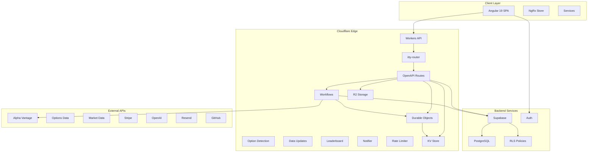
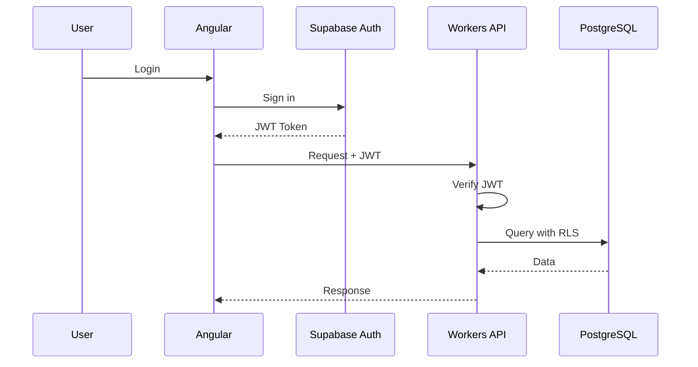
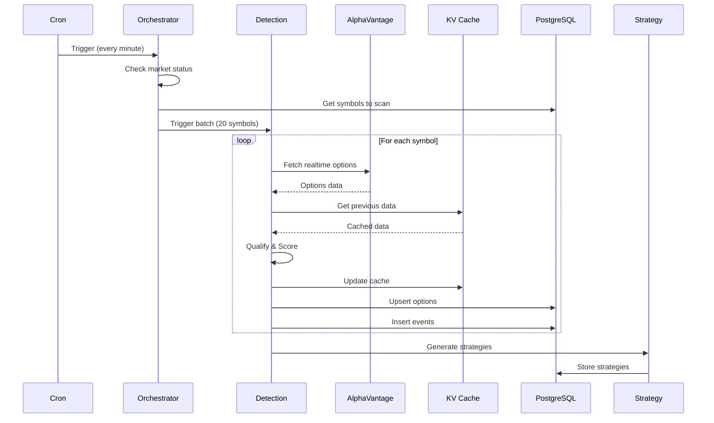
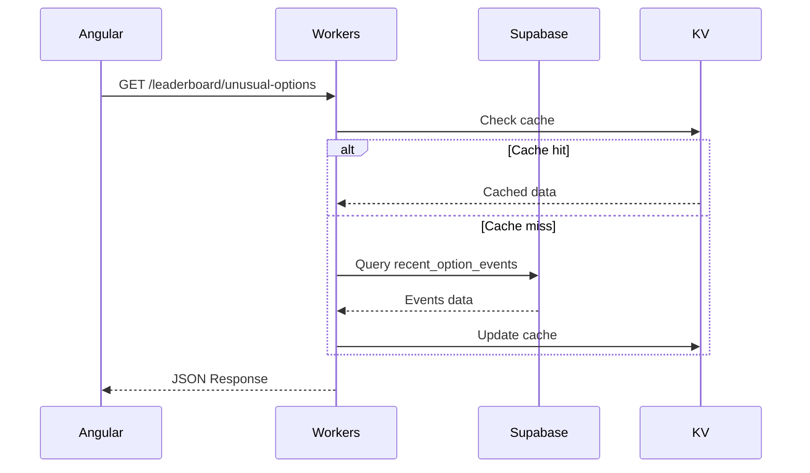

# System Architecture Overview

High-level architecture of the InMoney platform.

## Architecture Diagram



## Platform Components

### Frontend (inmoney)

| Aspect | Technology |
|--------|------------|
| **Framework** | Angular 19 (Standalone Components) |
| **State** | NgRx with Entity Adapters |
| **Styling** | TailwindCSS 4 + DaisyUI |
| **Change Detection** | Zoneless (Experimental) |
| **Build** | Vite |

**Repository**: [inmoney](https://github.com/delongZhai/inmoney)

### Backend (inmoney-api)

| Aspect | Technology |
|--------|------------|
| **Runtime** | Cloudflare Workers |
| **Routing** | itty-router + chanfana (OpenAPI) |
| **Background Jobs** | Cloudflare Workflows |
| **State** | Durable Objects |
| **Cache** | Cloudflare KV |
| **Storage** | Cloudflare R2 |
| **Database** | Supabase PostgreSQL |

**Repository**: [inmoney-api](https://github.com/delongZhai/inmoney-api)

---

## Backend Architecture

### Three Execution Models

```
┌─────────────────────────────────────────────────────────────────────────┐
│                      inmoney-api Architecture                            │
├─────────────────────────────────────────────────────────────────────────┤
│                                                                          │
│  ┌─────────────────────────────────────────────────────────────────┐   │
│  │                    Worker API (Synchronous)                      │   │
│  │  ─────────────────────────────────────────────────────────────  │   │
│  │  Location: src/routes/                                           │   │
│  │  Trigger: HTTP Requests                                          │   │
│  │  Lifetime: Milliseconds to seconds                               │   │
│  │  Endpoints: 67 routes                                            │   │
│  │                                                                   │   │
│  │  Categories:                                                      │   │
│  │  • /pay/*           - Stripe payments                            │   │
│  │  • /ratelimited/*   - Market data (rate-limited)                 │   │
│  │  • /indicator/*     - Technical indicators                       │   │
│  │  • /realtime-options/* - Options data                            │   │
│  │  • /leaderboard/*   - Unusual options leaderboard                │   │
│  │  • /strategies/*    - Strategy generation                        │   │
│  │  • /insights/*      - Options analytics                          │   │
│  │  • /llama/*         - AI analysis                                │   │
│  │  • /helpdesk/*      - GitHub issues                              │   │
│  │  • /realtime/*      - WebSocket control                          │   │
│  └─────────────────────────────────────────────────────────────────┘   │
│                                                                          │
│  ┌─────────────────────────────────────────────────────────────────┐   │
│  │                    Workflows (Asynchronous)                      │   │
│  │  ─────────────────────────────────────────────────────────────  │   │
│  │  Location: src/workflows/                                        │   │
│  │  Trigger: Cron schedules or manual                               │   │
│  │  Lifetime: Minutes to hours                                      │   │
│  │  Count: 14 workflows                                             │   │
│  │                                                                   │   │
│  │  Key Workflows:                                                   │   │
│  │  • DetectUnusualOptionsV2    - Option flow detection             │   │
│  │  • CalculateTrustScore       - Signal scoring                    │   │
│  │  • UpdateMarketListings      - Weekly market refresh             │   │
│  │  • UpdateCompanySnapshots    - Daily fundamentals                │   │
│  │  • GetAllFutureEarnings      - Earnings calendar                 │   │
│  └─────────────────────────────────────────────────────────────────┘   │
│                                                                          │
│  ┌─────────────────────────────────────────────────────────────────┐   │
│  │                  Durable Objects (Stateful)                      │   │
│  │  ─────────────────────────────────────────────────────────────  │   │
│  │  Location: src/durable-objects/                                  │   │
│  │  Trigger: Workers or HTTP                                        │   │
│  │  Lifetime: Persistent                                            │   │
│  │                                                                   │   │
│  │  Objects:                                                         │   │
│  │  • RealtimeOptionsLeaderboard - Live leaderboard state           │   │
│  │  • Notifier                   - WebSocket connections            │   │
│  │  • RateLimiter                - API rate limiting                │   │
│  └─────────────────────────────────────────────────────────────────┘   │
│                                                                          │
└─────────────────────────────────────────────────────────────────────────┘
```

### Core Systems

#### 1. Option Flow Engine
The heart of InMoney - detects unusual options activity in real-time.

**Flow:**
```
Cron (every minute) → GetNextSymbols → DetectUnusualOptionsV2 → Database
                                              ↓
                                    Strategy Generator
```

**Key Features:**
- Processes 300 symbols per minute during market hours
- 12 qualification codes (U001-U012) for labeling unusual activity
- Dynamic premium thresholds based on stock price
- Event type classification (BuyCall, SellCall, BuyPut, SellPut, Askside, Bidside)

See [Option Flow Engine](../backend/option-flow-engine.md) for details.

#### 2. Strategy System
Identifies multi-leg options strategies from detected activity.

**Supported Strategies (40+):**
- Single legs (Long Call, Long Put, etc.)
- Spreads (Bull Call, Bear Put, etc.)
- Straddles & Strangles
- Iron Condors & Butterflies
- Risk Reversals
- And more...

#### 3. Trust Score System
Calculates reliability scores for options signals based on user-defined filters.

---

## Database Architecture

### Primary: Supabase PostgreSQL

```
┌─────────────────────────────────────────────────────────────────┐
│                        Supabase PostgreSQL                       │
├─────────────────────────────────────────────────────────────────┤
│                                                                  │
│  Core Tables:                                                    │
│  ├── symbols           - Tradeable tickers                      │
│  ├── market_listings   - Active listings for scanning           │
│  ├── company_snapshots - Fundamental data                       │
│  └── etf_profiles      - ETF-specific data                      │
│                                                                  │
│  Options Tables:                                                 │
│  ├── options           - Master option contracts                │
│  ├── option_events     - Detected activity events               │
│  └── recent_option_events (MV) - 24h events with joins          │
│                                                                  │
│  User Tables:                                                    │
│  ├── profiles          - User profiles (extends auth.users)     │
│  ├── user_watchlists   - Watched symbols                        │
│  ├── user_preferences  - Settings                               │
│  ├── stripe_customers  - Stripe linkage                         │
│  └── trust_scores      - User filter scores                     │
│                                                                  │
│  Market Data:                                                    │
│  └── earnings          - Earnings calendar                      │
│                                                                  │
└─────────────────────────────────────────────────────────────────┘
```

### Cache: Cloudflare KV

| Namespace | Purpose | TTL |
|-----------|---------|-----|
| `REALTIME_OPTIONS_CACHE` | Previous cycle comparison | 5-10 min |
| `RATE_LIMIT_CACHE` | API rate limiting | Variable |
| `SEARCH_INDEXES` | Symbol search | 24 hours |

### Storage: Cloudflare R2

- Leaderboard JSON snapshots
- Large data exports

---

## Authentication Flow



---

## Data Flow

### Market Data Ingestion



### Client Data Request



---

## Environments

| Environment | Frontend | API | Database |
|-------------|----------|-----|----------|
| **Development** | localhost:4200 | localhost:8787 | Local Supabase |
| **Preview** | preview.inmoney.app | preview.api.inmoney.app | Staging DB |
| **Production** | inmoney.app | api.inmoney.app | Production DB |

---

## External Integrations

| Service | Purpose | Rate Limits |
|---------|---------|-------------|
| **Alpha Vantage** | Market & options data | 75 req/min (premium) |
| **Supabase** | Database + Auth | Connection pool based |
| **Stripe** | Payments | Standard Stripe limits |
| **OpenAI** | AI analysis | Token based |
| **Resend** | Email | 100/day (free) |
| **GitHub** | Issue tracking | 5000 req/hour |

---

## Security

### Authentication
- Supabase Auth with JWT tokens
- Service role key for backend operations
- RLS policies on all user tables

### API Security
- CORS configuration
- Subscription validation in production
- Rate limiting via Durable Objects

### Data Protection
- Row Level Security (RLS) on Supabase
- No direct database exposure
- Secrets in Cloudflare environment variables

---

## Monitoring & Observability

| Aspect | Tool |
|--------|------|
| **Workers Metrics** | Cloudflare Dashboard |
| **Database** | Supabase Dashboard |
| **Payments** | Stripe Dashboard |
| **Errors** | Cloudflare Workers Logs |

---

## Key File Paths

| Component | Path |
|-----------|------|
| **Entry Point** | `src/index.ts` |
| **Router** | `src/routes/index.ts` |
| **Scheduled Jobs** | `src/scheduled.ts` |
| **All Workflows** | `src/workflows/*.ts` |
| **All Routes** | `src/routes/*.ts` |
| **Durable Objects** | `src/durable-objects/` |
| **Market Data** | `src/market-data/` |
| **Strategies** | `src/utils/strategies/` |
| **Database Types** | `src/supabase/types_db.ts` |
| **Config** | `wrangler.toml` |
