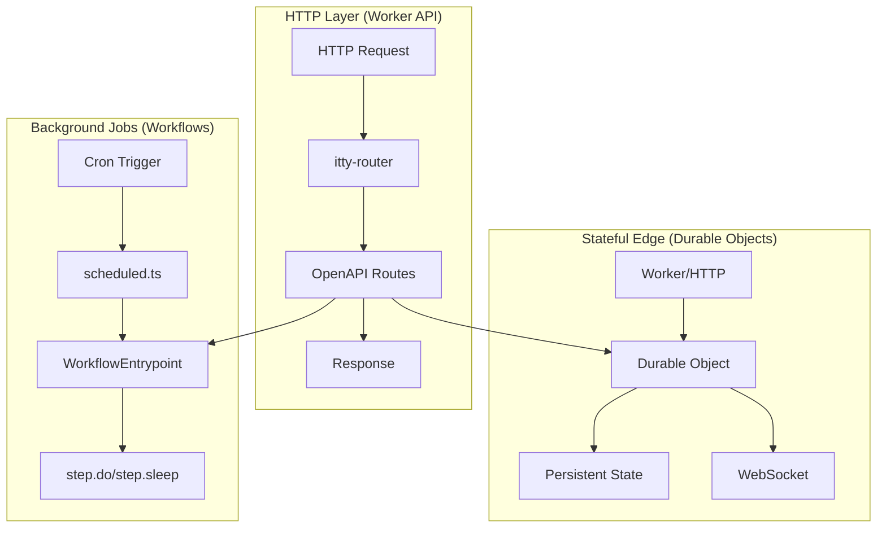

# Cloudflare Workers Architecture

The inmoney-api uses three Cloudflare compute models with clear separation of concerns.

## Overview



---

## 1. Worker API (HTTP Routes)

Synchronous HTTP handlers for immediate client responses.

### Location
`src/routes/`

### Entry Point
```typescript
// src/index.ts
export default {
  async fetch(request: Request, env: Env, ctx: ExecutionContext) {
    if (request.headers.get('Upgrade') === 'websocket') {
      return handleWebSocket(request, env);
    }
    return routerFactory(env).fetch(request);
  }
}
```

### Route Categories (67 Endpoints)

| Category | Path Prefix | Description |
|----------|-------------|-------------|
| **Payment** | `/pay/*` | Stripe checkout, billing portal |
| **Market Data** | `/ratelimited/*` | Proxied market data with rate limiting |
| **Technical Indicators** | `/indicator/*` | SMA, EMA, MACD, RSI, etc. |
| **Options** | `/realtime-options/*`, `/historical-options/*` | Options data |
| **Leaderboard** | `/leaderboard/*` | Unusual options leaderboard |
| **Strategies** | `/strategies/*` | Strategy generation |
| **Insights** | `/insights/*` | Options analytics |
| **LLaMA AI** | `/llama/*` | AI-powered analysis |
| **Helpdesk** | `/helpdesk/*` | GitHub issues integration |
| **Realtime** | `/realtime/*` | WebSocket status/control |
| **Search** | `/search-indexes` | Symbol search |
| **Market Schedule** | `/market-schedule/*` | Trading hours |

### Route Implementation Pattern

```typescript
// src/routes/get-realtime-options.ts
export class GetRealtimeOptions extends OpenAPIRoute {
  schema = {
    request: {
      params: z.object({ symbol: z.string() }),
      query: z.object({ contract: z.string().optional() })
    },
    responses: {
      200: { content: { 'application/json': { schema: RealtimeOptionsSchema } } }
    }
  };

  async handle(request: Request, env: Env, ctx: ExecutionContext) {
    const { params, query } = await this.getValidatedData<typeof this.schema>();
    return json(await GetRealtimeOptions.request(env, ctx, params.symbol, query));
  }

  // Static method allows workflows to call same logic
  static async request(env: Env, ctx: ExecutionContext, symbol: string, options?: Options) {
    const data = await getRealtimeOptions(env, symbol);
    return transformResponse(data);
  }
}
```

### Router Factory

```typescript
// src/routes/index.ts
export function routerFactory(env: Env) {
  const router = new OpenAPIRouter({
    docs_url: '/docs',
    schema: { info: { title: 'InMoney API', version: '1.0' } }
  });

  // CORS
  router.all('*', (request) => {
    if (request.method === 'OPTIONS') return new Response(null, { headers: corsHeaders });
  });

  // Production auth
  if (env.ENVIRONMENT === 'production') {
    router.all('*', validateSubscription);
  }

  // Register routes
  router.get('/realtime-options/:symbol', GetRealtimeOptions);
  router.post('/strategies/generator', GenerateStrategies);
  // ... 65 more routes

  return router;
}
```

---

## 2. Workflows (Background Jobs)

Long-running asynchronous tasks with built-in retry logic.

### Location
`src/workflows/`

### Configuration (wrangler.toml)
```toml
[[workflows]]
name = "detect-unusual-options-v2"
binding = "DETECT_UNUSUAL_OPTIONS_V2"
class_name = "DetectUnusualOptionsV2"

[[workflows]]
name = "calculate-trust-score"
binding = "CALCULATE_TRUST_SCORE"
class_name = "CalculateTrustScore"
```

### Cron Schedules (wrangler.toml)
```toml
[triggers]
crons = [
  "0 0 * * sun",           # Sunday midnight: Update market listings
  "0 22 * * mon-fri",      # Weekday 22:00 UTC: Update company snapshots
  "0 0 * * sat",           # Saturday midnight: Set ETF profiles
  "0 4 * * mon-fri",       # Weekday 04:00 UTC: Get future earnings
  "* 13-21 * * mon-fri"    # Every minute 13:00-21:00 UTC: Unusual options
]
```

### Workflow Catalog (14 Workflows)

| Workflow | Purpose | Trigger |
|----------|---------|---------|
| **DetectUnusualOptionsV2** | Detect unusual options activity | Every minute (market hours) |
| **DetectUnusualOptions** | Legacy detection (deprecated) | Manual |
| **GetNextSymbolsForUnusualOptionsDetection** | Symbol batching orchestrator | Every minute (market hours) |
| **CalculateTrustScore** | Calculate signal trust scores | Scheduled via route |
| **UpdateMarketListingsWorkflow** | Refresh market listings | Sunday midnight |
| **UpdateCompanySnapshotsWorkflow** | Update company fundamentals | Weekday 22:00 UTC |
| **SetEtfProfilesWorkflow** | Populate ETF profiles | Saturday midnight |
| **SetOptionsWorkflow** | Store historical options | Manual |
| **GetAllFutureEarnings** | Fetch upcoming earnings | Weekday 04:00 UTC |
| **AddEmailRecipientOnSignup** | Handle email subscriptions | Webhook |
| **AssertCustomerExist** | Validate Stripe customers | Webhook |
| **CheckExplorerUpdates** | Check data explorer updates | Manual |
| **CalculateCorrelationsBetweenSymbols** | Symbol correlation (placeholder) | Manual |
| **GetMarketNews** | Market news (placeholder) | Manual |

### Workflow Implementation Pattern

```typescript
// src/workflows/detect-unusual-options-v2.ts
type Params = { symbols: string[]; marketCaps: Record<string, number> };

export class DetectUnusualOptionsV2 extends WorkflowEntrypoint<Env, Params> {
  async run(event: WorkflowEvent<Params>, step: WorkflowStep) {
    const { symbols, marketCaps } = event.payload;

    // Step 1: Fetch options data
    const optionsData = await step.do('Fetch realtime options', async () => {
      const results = await Promise.all(
        symbols.map(s => GetRealtimeOptions.request(this.env, null, s))
      );
      return results;
    });

    // Step 2: Process and qualify
    const qualifiedOptions = await step.do('Qualify unusual options', async () => {
      return optionsData
        .flatMap(data => processOptions(data, marketCaps))
        .filter(option => option.qualify())
        .slice(0, computeTopX(optionsData.length, 5, 0.01));
    });

    // Step 3: Persist to database
    await step.do('Upsert to database', async () => {
      const client = getSupabaseAdmin(this.env);
      await client.from('options').upsert(buildOptionsUpsertRecords(qualifiedOptions));
      await client.from('option_events').insert(buildOptionEventsInsertPayload(qualifiedOptions));
    });

    // Step 4: Generate strategies (V2 only)
    await step.do('Generate strategies', async () => {
      const events = mapEntriesToGeneratorEvents(qualifiedOptions);
      await GenerateStrategies.request(this.env, null, events);
    });

    return { processed: qualifiedOptions.length };
  }
}
```

### Scheduled Event Handler

```typescript
// src/scheduled.ts
export async function handleScheduled(
  event: ScheduledEvent,
  env: Env,
  ctx: ExecutionContext
) {
  const hour = new Date(event.scheduledTime).getUTCHours();
  const dayOfWeek = new Date(event.scheduledTime).getUTCDay();

  // Every minute during market hours (13:00-21:00 UTC, Mon-Fri)
  if (hour >= 13 && hour <= 21 && dayOfWeek >= 1 && dayOfWeek <= 5) {
    await env.GET_NEXT_SYMBOLS_FOR_UNUSUAL_OPTIONS_DETECTION.create({ id: crypto.randomUUID() });
  }

  // Sunday midnight: Update market listings
  if (dayOfWeek === 0 && hour === 0) {
    await env.UPDATE_MARKET_LISTINGS_WORKFLOW.create({ id: crypto.randomUUID() });
  }

  // ... more schedules
}
```

---

## 3. Durable Objects (Stateful Edge)

Persistent stateful compute for real-time features.

### Location
`src/durable-objects/`

### Configuration (wrangler.toml)
```toml
[durable_objects]
bindings = [
  { name = "UNUSUAL_OPTIONS_LEADERBOARD", class_name = "RealtimeOptionsLeaderboard" },
  { name = "NOTIFIER", class_name = "Notifier" }
]

[[migrations]]
tag = "v1"
new_classes = ["RealtimeOptionsLeaderboard", "Notifier", "RateLimiter"]
```

### Durable Objects Catalog

| Durable Object | Purpose | Access Pattern |
|----------------|---------|----------------|
| **RealtimeOptionsLeaderboard** | Real-time leaderboard state | HTTP, internal |
| **Notifier** | WebSocket connections | WebSocket upgrade |
| **RateLimiter** | API rate limiting | Middleware |

### RealtimeOptionsLeaderboard

```typescript
// src/durable-objects/realtime-options-leaderboard/index.ts
export class RealtimeOptionsLeaderboard implements DurableObject {
  private state: DurableObjectState;
  private entries: Map<string, LeaderboardEntry> = new Map();

  constructor(state: DurableObjectState, env: Env) {
    this.state = state;
  }

  async fetch(request: Request): Promise<Response> {
    const url = new URL(request.url);

    if (request.method === 'POST') {
      const entries = await request.json<LeaderboardEntry[]>();
      for (const entry of entries) {
        this.entries.set(entry.option_id, entry);
      }
      await this.state.storage.put('entries', Array.from(this.entries.values()));
      return new Response('OK');
    }

    // GET: Return sorted leaderboard
    const sorted = Array.from(this.entries.values())
      .sort((a, b) => b.score - a.score)
      .slice(0, 100);
    return json(sorted);
  }
}
```

### Notifier (WebSocket)

```typescript
// src/durable-objects/notifier/index.ts
export class Notifier implements DurableObject {
  private connections: Set<WebSocket> = new Set();

  async fetch(request: Request): Promise<Response> {
    if (request.headers.get('Upgrade') !== 'websocket') {
      return new Response('Expected WebSocket', { status: 426 });
    }

    const pair = new WebSocketPair();
    const [client, server] = Object.values(pair);

    server.accept();
    this.connections.add(server);

    server.addEventListener('close', () => {
      this.connections.delete(server);
    });

    server.addEventListener('message', (event) => {
      this.handleMessage(server, JSON.parse(event.data as string));
    });

    return new Response(null, { status: 101, webSocket: client });
  }

  broadcast(message: object) {
    const data = JSON.stringify(message);
    for (const conn of this.connections) {
      conn.send(data);
    }
  }
}
```

### Accessing Durable Objects

```typescript
// From a route
async function getLeaderboard(env: Env) {
  const id = env.UNUSUAL_OPTIONS_LEADERBOARD.idFromName('global');
  const stub = env.UNUSUAL_OPTIONS_LEADERBOARD.get(id);
  return stub.fetch(new Request('https://dummy/'));
}

// From a workflow
await step.do('Update leaderboard', async () => {
  const id = this.env.UNUSUAL_OPTIONS_LEADERBOARD.idFromName('global');
  const stub = this.env.UNUSUAL_OPTIONS_LEADERBOARD.get(id);
  await stub.fetch(new Request('https://dummy/', {
    method: 'POST',
    body: JSON.stringify(entries)
  }));
});
```

---

## Env Bindings Summary

```typescript
interface Env {
  // Secrets
  SUPABASE_URL: string;
  SUPABASE_SERVICE_KEY: string;
  SUPABASE_JWT_SECRET: string;
  STRIPE_SECRET_KEY: string;
  ALPHA_VANTAGE_API_KEY: string;
  OPENAI_API_KEY: string;
  GITHUB_TOKEN: string;
  RESEND_API_KEY: string;

  // KV Namespaces
  REALTIME_OPTIONS_CACHE: KVNamespace;
  RATE_LIMIT_CACHE: KVNamespace;
  SEARCH_INDEXES: KVNamespace;

  // R2 Buckets
  LEADERBOARD_BUCKET: R2Bucket;

  // Durable Objects
  UNUSUAL_OPTIONS_LEADERBOARD: DurableObjectNamespace;
  NOTIFIER: DurableObjectNamespace;

  // Workflows (14 total)
  DETECT_UNUSUAL_OPTIONS_V2: Workflow;
  DETECT_UNUSUAL_OPTIONS: Workflow;
  GET_NEXT_SYMBOLS_FOR_UNUSUAL_OPTIONS_DETECTION: Workflow;
  CALCULATE_TRUST_SCORE: Workflow;
  UPDATE_MARKET_LISTINGS_WORKFLOW: Workflow;
  UPDATE_COMPANY_SNAPSHOTS_WORKFLOW: Workflow;
  SET_ETF_PROFILES_WORKFLOW: Workflow;
  SET_OPTIONS_WORKFLOW: Workflow;
  GET_ALL_FUTURE_EARNINGS: Workflow;
  ADD_EMAIL_RECIPIENT_ON_SIGNUP: Workflow;
  ASSERT_CUSTOMER_EXIST: Workflow;
  CHECK_EXPLORER_UPDATES: Workflow;
  CALCULATE_CORRELATIONS_BETWEEN_SYMBOLS: Workflow;
  GET_MARKET_NEWS: Workflow;

  // Environment
  ENVIRONMENT: 'development' | 'preview' | 'production';
}
```

---

## Execution Flow Summary

```
┌─────────────────────────────────────────────────────────────────────┐
│                        Request Types                                 │
├─────────────────────────────────────────────────────────────────────┤
│                                                                      │
│  HTTP Request ──────► Worker API (Routes) ──────► Response          │
│       │                     │                                        │
│       │                     ├──► Durable Object (state)              │
│       │                     └──► Workflow (async job)                │
│       │                                                              │
│  WebSocket ─────────► Durable Object (Notifier) ◄───► Client        │
│                                                                      │
│  Cron ──────────────► scheduled.ts ──────► Workflow ──► Database    │
│                                                                      │
└─────────────────────────────────────────────────────────────────────┘
```
